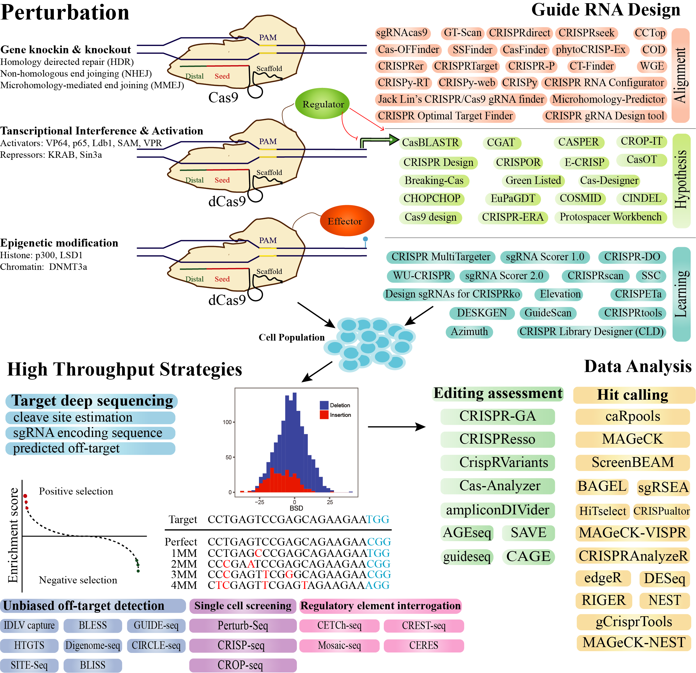

# awesome-CRISPR
List of software/websites/databases/papers for genome engineering, including (but not limited to) guide design, genome editing outcome, screening analysis, etc. [Contributions welcome](https://github.com/davidliwei/awesome-CRISPR/blob/master/CONTRIBUTING.md)..

This collection is inspired by [awesome-single-cell](https://github.com/seandavi/awesome-single-cell).

## Contents

- Guide design tools
- Off-target prediction algorithms
- Genome editing outcomes and predictions
- Screening analysis algorithms
- Databases
- Reviews

## Summary (not a complete list)

## Guide design

- [ATUM](https://www.atum.bio/eCommerce/cas9/input) - [webserver] - A website to design gRNA(s) which efficiently engineer your target and minimize off-target effects using ATUM Scoring Algorithms.
- [Benchling](https://benchling.com/crispr) - [webserver] - A website that can design optimal CRISPR gRNAs by analyzing target location, specificity, and efficiency.
- [Breaking-Cas](http://bioinfogp.cnb.csic.es/tools/breakingcas/) - [webserver] - A website of designing gRNAs based on multiple organisms.
- [Cas-Designer](http://www.rgenome.net/cas-designer/) - [webserver] - A bulge-allowed quick guide-RNA designer for CRISPR/Cas derived RGENs.
- [CRISPOR](http://crispor.tefor.net/) - [webserver] - A program helps to design, evaluate and clone guide sequences for the CRISPR/Cas9 system.
- [CRISPRa/i](https://portals.broadinstitute.org/gpp/public/analysis-tools/sgrna-design-crisprai) - [webserver] - This tool ranks and picks CRISPRa/i sgRNA sequences candidates by the gene targets provided, while attempting to maximize on-target activity and minimizing off-target activity.
- [CRRISPRdirect](http://crispr.dbcls.jp/) - [webserver] - A software for designing CRISPR/Cas guide RNA with reduced off-target sites.
- [CRISPR Library Designer](https://github.com/boutroslab/cld_docker) - [software] - A software for the multispecies design of sgRNA libraries.
- [CRISPR LifePipe](https://www.lifeandsoft.com/crisprlifepipe) - [webserver] - A web application which allows designing gRNA and donor DNA sequences for CRISPR experiments.
- [CRISPR MultiTargeter](http://www.multicrispr.net/index.html)- [webserver] - A web-based tool which automatically searches for CRISPR guide RNA targets. It can find highly similar or identical target sites in multiple genes, transcripts or design targets unique to particular genes or transcripts.
- [CRISPR-DO](http://cistrome.org/crispr/) - [webserver] - A web application for designing and optimizing of guide sequences that target both coding and non-coding regions in spCas9 CRISPR system across human, mouse, zebrafish, fly and worm genomes.
- [CRISPR-FOCUS](http://cistrome.org/crispr-focus/) - [webserver] -  A web-based platform to search and prioritize sgRNAs for CRISPR screening experiments.
- [CRISPR-ko](https://portals.broadinstitute.org/gpp/public/analysis-tools/sgrna-design) - [webserver] - A tool ranks and picks sgRNA sequences candidates for the targets provided while attempting to maximize on-target activity and minimize off-target activity.
- [CRISPR-P](http://crispr.hzau.edu.cn/CRISPR2/) - [webserver] - One of the most popular tools for sgRNA design in plants with minimal off-target effects.
- [CRISPR-Plant](https://www.genome.arizona.edu/crispr/) - [webserver] - This tool provides a platform to help researchers to design and construct specific gRNAs for CRISPR-Cas9 mediated genome editing in plants.
- [CRISPRdirect](http://crispr.dbcls.jp) - [webserver] - An algorithm for on-Target sgRNA design.
- [CRISPRscan](http://www.crisprscan.org) - [webserver] - A novel algorithm to predict gRNA efficiency.
- [CRISPRseek](https://bioconductor.org/packages/release/bioc/html/CRISPRseek.html) - [R] - A Bioconductor Package for identifying target-specific guide RNAs for CRISPR-Cas9 Genome-Editing Systems.
- [CRISPy-web](https://crispy.secondarymetabolites.org/#/input) - [webserver] - This tool allows researchers to interactively select a region of their genome of interest to scan for possible sgRNAs.
- [CROP-IT](http://cheetah.bioch.virginia.edu/AdliLab/CROP-IT/homepage.html) - [webserver] - A web tool assists biologists in designing CRISPR/CAS9 sgRNAs, by predicting the off-target sites and ranking them according to the chances of occurrence.
- [DeepCRISPR](https://github.com/bm2-lab/DeepCRISPR) - [Python, webserver] - A deep learning based prediction model for sgRNA on-target knockout efficacy and genome-wide off-target cleavage profile prediction.
- [DRSC](http://www.flyrnai.org/crispr) - [webserver] - This tool provides reagents targeting individual genes, focused libraries, genome-scale libraries, and other resources for on-site screening.
- [E-CRISP:](http://www.e-crisp.org/E-CRISP/) - [webserver] - An algorithm is available for twelve organisms and can be easily extended to design both sgRNA and pgRNA.
- [GPP Web Portal](https://portals.broadinstitute.org/gpp/public/) - [webserver] -  A web-based platform for generating matching sgRNA knockout (CRISPRko) designed for a mouse or human gene, transcript or target sequence.
- [Guide Picker](https://www.deskgen.com/guidebook//) - [webserver] -  A meta-tool for designing CRISPR experiments by presenting ten different guide RNAs scoring functions in one simple graphical interface.
- [GUIDES](http://guides.sanjanalab.org/#/) - [webserver] - A web application to design customized CRISPR knockout libraries as easily as possible without sacrificing control.
- [Horizon Discovery](https://dharmacon.horizondiscovery.com/gene-editing/crispr-cas9/crispr-design-tool/) - [webserver] - It provides an intuitive one-stop location for guide RNA design and ordering. Use the design tool to order guide RNAs for targeted gene knockout or HDR-mediated genome editing.
- [IDT](https://www.idtdna.com/site/order/designtool/index/CRISPR_CUSTOM) - [webserver] - It can generate CRISPR-Cas9 guide RNAs targeting any sequence from any species.
- [Off-Spotter](https://cm.jefferson.edu/Off-Spotter/) - [webserver] - A website identifies all genomic instances for the given combination of gRNA(s), PAM, number of mismatches, and seed.
- [pgRNADesign](https://bitbucket.org/liulab/pgrnadesign.git) - [Python] -  An algorithm to design paired gRNAs for knocking out long non-coding RNAs (lncRNAs).
- [Protospacer Workbench](http://www.protospacer.com) - [software] - Protospacer Workbench offers an interface for finding, evaluating, and sharing Cas9 guide-RNA (gRNA) designs.
- [SSC](http://cistrome.org/SSC/) - [webserver] - A sequence model for predicting sgRNA efficiency in CRISPR/Cas9 knockout experiments.
- [ssfinder](https://code.google.com/archive/p/ssfinder/) - [software] - A high throughput CRISPR-Cas target sites prediction tool.
- [Synthego](https://www.synthego.com/products/bioinformatics/crispr-design-tool) - [webserver] - A software chooses from over 120,000 genomes and over 8,300 species to easily design guide RNAs for gene knockout with minimal off-target effects.
- [WU-CRISPR](http://crispr.wustl.edu) - [webserver] - A web tool to design gRNA for CRISPR/Cas9 Knockout system.

## Off-target prediction algorithms

- [CasFinder](http://arep.med.harvard.edu/CasFinder/) - [Python] - An algorithm for identifying specific Cas9 targets in genomes.
- [CasOT](http://casot.cbi.pku.edu.cn/) - [webserver] - A tool to find potential off-target sites in any given genome or user-provided sequence, with user-specified types of the protospacer adjacent motif, and the number of mismatches allowed in the seed and non-seed regions.
- [Cas-OFFinder](http://www.rgenome.net/cas-offinder/) - [webserver] - An algorithm that searches for potential off-target sites of Cas9 RNA-guided endonucleases.
- [CCtop](https://crispr.cos.uni-heidelberg.de) - [webserver] - An algorithm to predict CRISPR/Cas9 target.
- [CHOPCHOP](http://chopchop.cbu.uib.no/index.php) - [webserver] - A web tool for selecting target sites for CRISPR/Cas9, CRISPR/Cpf1.
- [CRISPR RGEN Tools](http://www.rgenome.net) - [webserver] - An algorithm can identify of RGEN off-target sites without limitation by the number of mismatches and allow variations in PAM sequences recognized by Cas9. Meanwhile, it can search for RGEN targets with low potential off-target effects and high knock-out efficiencies in the exon region.
- [CRISPRTarget](http://bioanalysis.otago.ac.nz/CRISPRTarget/crispr_analysis.html) - [webserver] - A tool to explore the targets of CRISPR RNAs.
- [flyCRISPR](http://targetfinder.flycrispr.neuro.brown.edu) - [webserver] - Specificity for Drosophila to find CRISPR target sites and evaluate each identified CRISPR target.
- [Geneious CRISPR Site Finder](https://www.geneious.com/academic/) - [software] - It searches for off-target binding sites against a database of sequences.
- [GT-Scan](https://gt-scan.csiro.au/) - [webserver] - A flexible web-based tool that ranks all potential targets in a user-selected region of a genome in terms of how many off-targets they have.
- [GT-Scan2](https://github.com/BauerLab/GT-Scan2) - [R] - It is Chromatin- and Transcription-aware target site optimization tool for CRISPR/CAS9.
- [sgRNAcas9](http://www.biootools.com/) - [software] - A software package that can be applied to search rapidly for CRISPR target sites, and analyze the potential off-target cleavage sites of CRISPR-Cas9 simultaneously.
- [WGE](https://www.sanger.ac.uk/htgt/wge/) - [webserver] - A algorithm shows CRISPR sites (paired or single) in and around genes and scores the pairs for potential off-target sites, and browse individual and paired CRISPR sites across human, mouse.

## Genome editing outcomes and predictions

- [CRISPResso2](http://crispresso2.pinellolab.org/) - [Python, webserver] - A software pipeline for the analysis of targeted CRISPR-Cas9 sequencing data. This algorithm allows for the quantification of both non-homologous ends joining (NHEJ) and homologous directed repair (HDR) occurrences.
- [CrispRVariants](https://github.com/markrobinsonuzh/CrispRVariants) - [R] - A R-based toolkit for counting, localizing and plotting targeted insertion and deletion variant combinations from CRISPR-Cas9 mutagenesis experiments.
- [CRISPR-GA](http://crispr-ga.net) - [webserver] -  A platform to assess the quality of gene editing using NGS data to quantify and characterize insertions, deletions, and homologous recombination.
- [FORECasT](https://partslab.sanger.ac.uk/FORECasT) - [Python, webserver] - A method to predict and view mutational profiles for individual gRNAs.
- [inDelphi](https://www.crisprindelphi.design) - [webserver] - A computational model that predicts the heterogeneous (100+ unique) mixture of indels resulting from microhomology-mediated end-joining (MMEJ) and non-homologous end-joining (NHEJ) at a CRISPR-induced cut. inDelphi synthesizes known biological mechanisms of DNA repair with machine learning and achieves strong accuracy.
- [Lindel](https://lindel.gs.washington.edu/Lindel/) - [webserver] -  A Logistic regression model for accurate indel prediction induced by Cas9 cleavage. [NAR 2019](https://academic.oup.com/nar/advance-article/doi/10.1093/nar/gkz487/5511473)
- [Microhomology-Predictor](http://www.rgenome.net/mich-calculator/) - [webserver] - A web tool can simply predict the mutation patterns caused by microhomology-mediated end joining (MMEJ) and estimate how frequently unwanted in-frame deletions would happen.
- [SPROUT](https://zou-group.github.io/SPROUT) - [webserver] - A machine learning algorithm to predict the repair outcome of a CRISPR-CAS9 knockout experiment. Trained in primary human T cells, SPROUT may facilitate design of SpCas9 guide RNAs in therapeutically important primary human cells.

## Screening analysis

- [BAGEL](https://sourceforge.net/projects/bagel-for-knockout-screens/) - [Python] - An algorithm is designed to identify negatively selected genes, by calculating a Bayes factor for each gene representing a confidence measure that the gene knockout results in a fitness defect. Bayesian analysis of gene knockout screens using pooled library CRISPR or RNAi.
- [casTLE](https://bitbucket.org/dmorgens/castle) - [Python] - Based on the empirical Bayesian framework to account for multiple sources of variability, including reagent efficacy and off-target effects.
- [CaRpools](https://github.com/boutroslab/caRpools) - [R] - A pipeline for end-to-end analysis of pooled CRISPR/Cas9 screening data. Including in-depth analysis of screening quality and sgRNA phenotypes.
- [CERES](https://depmap.org/ceres/) - [R] -  An algorithm to estimate gene-dependency levels from CRISPR-Cas9 essentiality screens while accounting for this effect.
- [CRISPRCloud2](http://crispr.nrihub.org/) - [webserver] - A secure, convenient, and precise analysis pipeline for the deconvolution of your CRISPR pooled screening data.
- [DrugZ](https://github.com/hart-lab/drugz) - [python] - DrugZ is a software that detects synergistic and suppressor drug-gene interactions in CRISPR screens. Paper: [Genome Medicine 2019](https://genomemedicine.biomedcentral.com/articles/10.1186/s13073-019-0665-3).
- [edgeR](http://www.bioconductor.org/packages/release/bioc/html/edgeR.html) - [R] - Known as an RNA-seq differential expression analysis tool, edgeR also provides complete analysis solution for screening data.
- [gscreend](http://bioconductor.org/packages/gscreend) - [R] - Modelling asymmetric count ratios in CRISPR screens to decrease experiment size and improve phenotype detection. Paper: [Genome Biology 2020](https://genomebiology.biomedcentral.com/articles/10.1186/s13059-020-1939-1).
- [HitSelect](https://github.com/diazlab/) - [matlab] - A comprehensive tool for high-complexity-pooled screen analysis.
- [JACKS](https://github.com/felicityallen/JACKS) - [Python] - A Bayesian method that jointly analyses screens performed with the same guide RNA library.
- [MAGeCK](https://bitbucket.org/liulab/mageck) - [Python] - Model-based Analysis of Genome-wide CRISPR-Cas9 Knockout (MAGeCK) for prioritizing single-guide RNAs, genes and HiTSelectpathways in genome-scale CRISPR/Cas9 knockout screens. Paper: [Genome Biology 2014](https://genomebiology.biomedcentral.com/articles/10.1186/s13059-014-0554-4)
- [MAGeCKFlute](https://bitbucket.org/liulab/mageckflute/) - [R] - A pipeline for performing computational analysis of CRISPR screens. MAGeCKFlute combines the MAGeCK and MAGeCK-VISPR algorithms and incorporates additional downstream analysis functionalities.
- [MAGeCK-VISPR](https://bitbucket.org/liulab/mageck-vispr) - [Python] - A comprehensive quality control, analysis and visualization workflow for CRISPR/Cas9 screens.
- [RIGER](https://software.broadinstitute.org/GENE-E/extensions.html) - [Gene-E extension] - RNAi Gene Enrichment Ranking (RIGER).
- [RSA](https://admin-ext.gnf.org/publications/RSA/) - [perl, R, C#] - Redundant siRNA Activity (RSA) is a probability-based approach for the analysis of large-scale RNAi screens.
- [scMAGeCK](https://bitbucket.org/weililab/scmageck) - [Python, R] - A computational model to identify genes associated with multiple expression phenotypes from CRISPR screening coupled with single-cell RNA sequencing data. Paper: [Genome Biology 2020](https://genomebiology.biomedcentral.com/articles/10.1186/s13059-020-1928-4)
- [ScreenBEAM](https://github.com/jyyu/ScreenBEAM) - [R] - Gene-level meta-analysis of high-throughput functional genomics (RNAi or CRISPR) screens.
- [STARS](https://portals.broadinstitute.org/gpp/public/software/stars) - [Python] - A gene-ranking algorithm for genetic perturbation screens, computing a score for genes using the probability mass function of a binomial distribution. To analyze either shRNA or sgRNA based screening data.

## Databases
- [BioGRID ORCS](https://orcs.thebiogrid.org) - [webserver] - An open repository of CRISPR screens compiled through comprehensive curation efforts. Paper: [Nucleic Acids Research 2019](https://www.ncbi.nlm.nih.gov/pubmed/30476227)
- [CRISP-View](http://bit.ly/crisprview) - [webserver] - A comprehensive database of published CRISPR screening dataset. Datasets are uniformly processed using an integrated MAGeCK-VISPR pipeline with quality control (QC) evaluations. Users can browse, search and visualize cell lines, conditions, genes and associated sgRNAs across datasets.
- [DepMap](https://depmap.org/portal/) - [webserver] - A comprehensive reference map of the Cancer Dependency Map project at the Broad Institute. Paper: [Cell 2017](https://www.ncbi.nlm.nih.gov/pubmed/28753430)
- [GenomeCRISPR](http://genomecrispr.dkfz.de) - [webserver] - A database for high-throughput CRISPR/Cas9 screening experiments.
- [PICKLES](https://hartlab.shinyapps.io/pickles/) - [webserver] - A database of pooled in-vitro CRISPR knockout library essentiality screens.
- [Project Drive](https://oncologynibr.shinyapps.io/drive/) - [webserver] - A Compendium of Cancer Dependencies and Synthetic Lethal Relationships Uncovered by Large-Scale, Deep RNAi Screening. Paper: [Cell 2017](https://www.ncbi.nlm.nih.gov/pubmed/28753431).
- [Project Score (Sanger DepMap)](https://score.depmap.sanger.ac.uk/) - [webserver] - Genome-scale CRISPR–Cas9 screens in 324 human cancer cell lines from 30 cancer types. Paper: [Nature 2019](https://www.ncbi.nlm.nih.gov/pubmed/30971826).

## Reviews
- 2018 - Doench - [Am I ready for CRISPR? A user's guide to genetic screens.](https://www.ncbi.nlm.nih.gov/pubmed/29199283)
- 2019 - Esposito et al. - [Hacking the Cancer Genome: Profiling Therapeutically Actionable Long Non-coding RNAs Using CRISPR-Cas9 Screening.](https://www.cell.com/cancer-cell/fulltext/S1535-6108(19)30053-4)
