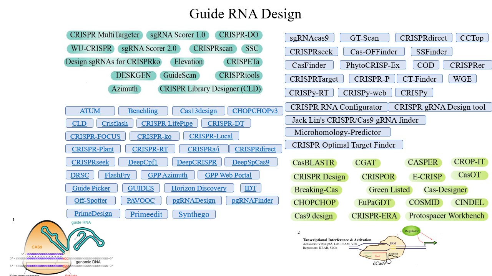
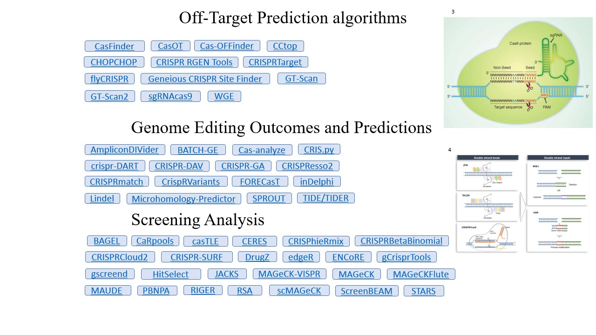
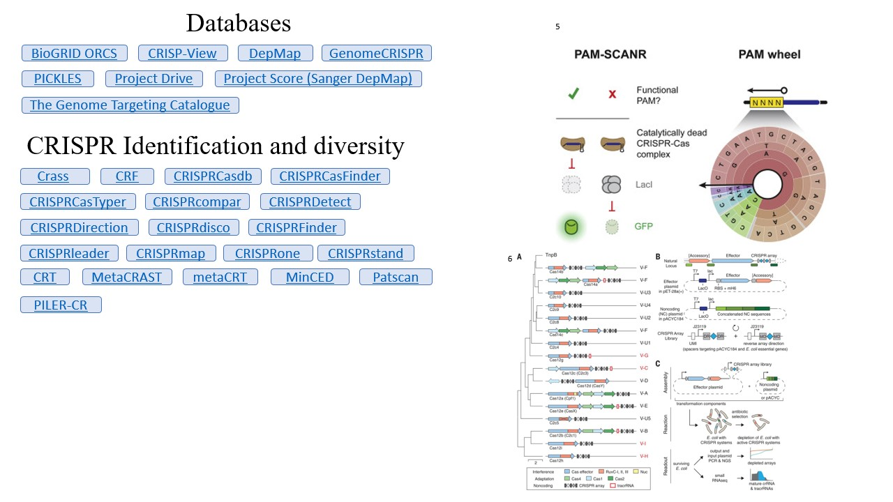

# awesome-CRISPR

List of software/websites/databases/papers for genome engineering, including (but not limited to) guide design, genome editing outcome, screening analysis, etc. [Contributions welcome](https://github.com/davidliwei/awesome-CRISPR/blob/master/CONTRIBUTING.md)..

This collection is inspired by [awesome-single-cell](https://github.com/seandavi/awesome-single-cell).

Did you use any of the softwares below? Take a survey [here](https://forms.gle/qbX7mkjm7U6JSSR4A)!

**Recommended** label lists my favorites -- they only reflect my personal reference and are not rigorously evaluated. Contact me if you would like other software to be added!

## Contents

- Guide design tools
- Off-target prediction algorithms
- Genome editing outcomes and predictions
- Screening analysis algorithms
- Databases
- CRISPR identification and diversity
- Reviews

## Summary (not a complete list)

References:

- 1 [link](https://labs.biology.ucsd.edu/zhao/CRISPR_web/RGR_design_home_frame_set.html)
- 2  [Zhang et al. Cell Press 4(1), 2, 2015](https://www.sciencedirect.com/science/article/pii/S216225311630049X)
- 3  [Li et al. Signal Transduction and Targeted Therapy 5(1), 2, 2020](https://labs.biology.ucsd.edu/zhao/CRISPR_web/RGR_design_home_frame_set.html)
- 4  [Leenay et al. Molecular Cell 62(1), 137–147, 2016](https://www.cell.com/molecular-cell/pdf/S1097-2765(16)00175-1.pdf)
- 5  [Yan et al. Prokaryotic Immunity 363, 88-91, 2019](https://science.sciencemag.org/content/sci/363/6422/88.full.pdf)

## Guide design

- [ATUM](https://www.atum.bio/eCommerce/cas9/input) - [webserver] - A website to design gRNA(s) which efficiently engineer your target and minimize off-target effects using ATUM Scoring Algorithms.
- [BE-DICT](http://www.be-dict.org) - [Python, webserver] - An attention-based deep learning algorithm capable of predicting base editing outcomes. It is aimed to assist scientists in designing base editor experiments.
- [beditor](https://github.com/rraadd88/beditor) - [python] - A Computational Workflow for Designing Libraries of sgRNAs for CRISPR-Mediated Base Editing.
- [Benchling](https://benchling.com/crispr) - [webserver] - A website that can design optimal CRISPR gRNAs by analyzing target location, specificity, and efficiency.
- [Breaking-Cas](http://bioinfogp.cnb.csic.es/tools/breakingcas/) - [webserver] - A website of designing gRNAs based on multiple organisms.
- [Cas-Designer](http://www.rgenome.net/cas-designer/) - [webserver] - A bulge-allowed quick guide-RNA designer for CRISPR/Cas derived RGENs.
- [Cas13design](https://cas13design.nygenome.org/) - [webserver] - This resource provides optimized guide RNAs to target transcripts in the human transcriptome, model organisms and viral RNA genomes.
- [CGAT](https://cgat.readthedocs.io/en/latest/cgat.html) - [python] - CGAT provides an extensive suite of tools designed to assist in the analysis of genome scale data from a range of standard file formats.
- [CHOPCHOPv3](https://chopchop.cbu.uib.no/)-[webserver] - A web tool for selecting target sites for CRISPR/Cas9, CRISPR/Cpf1, CRISPR/Cas13 or NICKASE/TALEN-directed mutagenesis.
- [CLD](https://github.com/boutroslab/cld) - [software] - CRISPR library designer (CLD), a software for multispecies design of single guide RNA libraries
- [Crackling](https://github.com/bmds-lab/Crackling) - [software] - Crackling is a standalone pipeline that combines multiple scoring approaches and constant-time search algorithms to select safe and efficient CRISPR-Cas9 guide RNA from whole genomes
- [Crisflash](https://github.com/crisflash/crisflash)- [software] - A software to generate CRISPR guide RNAs against genomes annotated with individual variation.
- [CRISPETa](http://crispeta.crg.eu/) - [python, webserver] - A flexible tool to design optimal pairs of sgRNAs for deletion of desired genomic regions.
- [CRISpick](https://portals.broadinstitute.org/gppx/crispick/public) - [webserver] - CRISPick, developed by the Broad Institute, ranks and picks candidate CRISPRko/a/i sgRNA sequences
to maximize on-target activity for target(s) provided. **Recommended**
- [CRISPOR](http://crispor.tefor.net/) - [webserver] - A program helps to design, evaluate and clone guide sequences for the CRISPR/Cas9 system.
- [crisprBase](https://github.com/Jfortin1/crisprBase) - [R] - Base functions and classes for CRISPR gRNA design for the Bioconductor project
- [crisprBowtie](https://github.com/Jfortin1/crisprBowtie) - [R] - A Bioconductor package for on- and off-target alignment of CRISPR guide RNAs with Bowtie.
- [crisprBwa](https://github.com/Jfortin1/crisprBwa) - [R] - A Bioconductor package for on- and off-target alignment of CRISPR guide RNAs with BWA.
- [crisprDesign](https://github.com/Jfortin1/crisprDesign) - [R] - A Bioconductor package for comprehensive design of CRISPR gRNAs across nucleases and base editors.
- [CRISPR Library Designer](https://github.com/boutroslab/cld_docker) - [software] - A software for the multispecies design of sgRNA libraries.
- [CRISPR LifePipe](https://www.lifeandsoft.com/crisprlifepipe) - [webserver] - A web application which allows designing gRNA and donor DNA sequences for CRISPR experiments.
- [CRISPR MultiTargeter](http://www.multicrispr.net/index.html)- [webserver] - A web-based tool which automatically searches for CRISPR guide RNA targets. It can find highly similar or identical target sites in multiple genes, transcripts or design targets unique to particular genes or transcripts.
- [CRISPR-DO](http://cistrome.org/crispr/) - [webserver] - A web application for designing and optimizing of guide sequences that target both coding and non-coding regions in spCas9 CRISPR system across human, mouse, zebrafish, fly and worm genomes. **Recommended**
- [CRISPR-DT](http://bioinfolab.miamioh.edu/CRISPR-DT/)-[webserver] - A web application that allows a user to upload DNA sequences, set specifications according to experimental goals, and recieve target candidates.
- [CRISPR-ERA](http://crispr-era.stanford.edu/) - [webserver] -	A Fast and Comprehensive Guide RNA Design Tool for Genome Editing, Repression and Activation.
- [CRISPR-FOCUS](http://cistrome.org/crispr-focus/) - [webserver] -  A web-based platform to search and prioritize sgRNAs for CRISPR screening experiments. **Recommended**
- [CRISPR-ko](https://portals.broadinstitute.org/gpp/public/analysis-tools/sgrna-design) - [webserver] - A tool ranks and picks sgRNA sequences candidates for the targets provided while attempting to maximize on-target activity and minimize off-target activity.
- [CRISPR-Local](http://crispr.hzau.edu.cn/CRISPR-Local/) - [software, webserver] - A local single-guide RNA (sgRNA) design tool for non-reference plant genomes
- [CRISPR-P](http://crispr.hzau.edu.cn/CRISPR2/) - [webserver] - One of the most popular tools for sgRNA design in plants with minimal off-target effects.
- [CRISPR-Plant](https://www.genome.arizona.edu/crispr/) - [webserver] - This tool provides a platform to help researchers to design and construct specific gRNAs for CRISPR-Cas9 mediated genome editing in plants.
- [CRISPR-RT](http://bioinfolab.miamioh.edu/CRISPR-RT/)- [webserver] - A web application for RNA-targeting prediction and visualization with the CRISPR-C2c2/Cas13a System.
- [CRISPRa/i](https://portals.broadinstitute.org/gpp/public/analysis-tools/sgrna-design-crisprai) - [webserver] - This tool ranks and picks CRISPRa/i sgRNA sequences candidates by the gene targets provided, while attempting to maximize on-target activity and minimizing off-target activity.
- [CRISPRdirect](http://crispr.dbcls.jp) - [webserver] - An algorithm for on-Target sgRNA design.
- [CRISPRscan](http://www.crisprscan.org) - [webserver] - A novel algorithm to predict gRNA efficiency.
- [crisprScore](https://github.com/Jfortin1/crisprScore) - [R] - A Bioconductor package for on- and off-target scoring of guide RNAs.
- [CRISPRseek](https://bioconductor.org/packages/release/bioc/html/CRISPRseek.html) - [R] - A Bioconductor Package for identifying target-specific guide RNAs for CRISPR-Cas9 Genome-Editing Systems.
- [crisprVerse](https://github.com/crisprVerse) [R] - A comprehensive Bioconductor ecosystem for the design of CRISPR guide RNAs across nucleases and technologies.
- [CRISPy-web](https://crispy.secondarymetabolites.org/#/input) - [webserver] - This tool allows researchers to interactively select a region of their genome of interest to scan for possible sgRNAs.
- [CROP-IT](http://cheetah.bioch.virginia.edu/AdliLab/CROP-IT/homepage.html) - [webserver] - A web tool assists biologists in designing CRISPR/CAS9 sgRNAs, by predicting the off-target sites and ranking them according to the chances of occurrence.
- [CT-Finder](http://bioinfolab.miamioh.edu/ct-finder/) - [webserver] - A web service that allows a user to upload DNA sequences, set specifications according to experimental goals, and receive candidate guide RNA targets.
- [DeepCas13](http://deepcas13.weililab.org) - [webserver] - A deep learning method to predict the efficiency of Cas13d (CasRx) RNA knockdown system.
- [DeepCpf1](http://deepcrispr.info/) - [python, webserver] - Deep learning-based prediction of CRISPR-Cpf1 activity at endogenous sites.
- [DeepCRISPR](https://github.com/bm2-lab/DeepCRISPR) - [Python, webserver] - A deep learning based prediction model for sgRNA on-target knockout efficacy and genome-wide off-target cleavage profile prediction.
- [DeepHF](http://www.deephf.com/) - [webserver] - Optimized CRISPR guide RNA design for two high-fidelity Cas9 variants by deep learning.
- [DeepSpCas9](http://deepcrispr.info/DeepSpCas9/) - [python, webserver] - A deep learning–based computational model for SpCas9 activity prediction
- [DRSC](http://www.flyrnai.org/crispr) - [webserver] - This tool provides reagents targeting individual genes, focused libraries, genome-scale libraries, and other resources for on-site screening.
- [E-CRISP:](http://www.e-crisp.org/E-CRISP/) - [webserver] - An algorithm is available for twelve organisms and can be easily extended to design both sgRNA and pgRNA.
- [EuPaGDT](http://grna.ctegd.uga.edu/)- [webserver] - A web tool tailored to design CRISPR guide RNAs for eukaryotic pathogens
- [FlashFry](https://github.com/mckennalab/FlashFry) - [software] - A command line tool for high-throughput design and screening of Cas9,Cas12a/Cpf1 and other CRISPR targets, with a focus on speed. Many design metrics are available, including common on and off-target scores.
- [GPP Azimuth](https://portals.broadinstitute.org/gpp/public/analysis-tools/sgrna-design)- [webserver] - A tool that ranks and picks candidate CRISPRko sgRNA sequences for the targets provided, while attempting to maximize on-target activity and minimizing off-target activity. **Replaced by CRISPick**
- [GPP Web Portal](https://portals.broadinstitute.org/gpp/public/) - [webserver] -  A web-based platform for generating matching sgRNA knockout (CRISPRko) designed for a mouse or human gene, transcript or target sequence.
- [Guide Picker](https://www.deskgen.com/guidebook//) - [webserver] -  A meta-tool for designing CRISPR experiments by presenting ten different guide RNAs scoring functions in one simple graphical interface.
- [GuideHOM](https://colab.research.google.com/drive/1VJkhQeqW1OkMG0VJoxcpML7LtnkvTX9e?usp=sharing) - [Google Colab] - An algorithm to search and analyze on-target and off-target cleavage efficiency of gRNAs with additional information on prediction variance; Uncertainty-aware and interpretable evaluation of Cas9-gRNA and Cas12a-gRNA specificity for fully matched and partially mismatched targets with Deep Kernel Learning.
- [GUIDES](http://guides.sanjanalab.org/) - [webserrver] - A web application to design customized CRISPR knockout libraries as easily as possible without sacrificing control.
- [GuideScan](http://www.guidescan.com/) - [webserver] - A generalized CRISPR guideRNA design tool.
- [Horizon Discovery](https://dharmacon.horizondiscovery.com/gene-editing/crispr-cas9/crispr-design-tool/) - [webserver] - It provides an intuitive one-stop location for guide RNA design and ordering. Use the design tool to order guide RNAs for targeted gene knockout or HDR-mediated genome editing.
- [IDT](https://www.idtdna.com/site/order/designtool/index/CRISPR_CUSTOM) - [webserver] - It can generate CRISPR-Cas9 guide RNAs targeting any sequence from any species.
- [Off-Spotter](https://cm.jefferson.edu/Off-Spotter/) - [webserver] - A website identifies all genomic instances for the given combination of gRNA(s), PAM, number of mismatches, and seed.
- [PAVOOC](https://pavooc.me/) - [webserver] - A web tool that design and control cutting-edge-scored sgRNAs in the blink of an eye.
- [pgRNADesign](https://bitbucket.org/liulab/pgrnadesign.git) - [Python] -  An algorithm to design paired gRNAs for knocking out long non-coding RNAs (lncRNAs).
- [pgRNAFinder](https://github.com/xiexiaowei/pgRNAFinder)-[python]- A web-based tool to design distance independent paired-gRNA
- [PrimeDesign](http://primedesign.pinellolab.org/) - [webserver, software] -  A flexible and comprehensive design tool for prime editing.
- [Primeedit](https://primeedit.nygenome.org/) - [webserver] - This website designs pegRNAs and secondary sgRNAs for PE2, PE3 and PE3b prime editors for ClinVar human pathogenic variants.
- [Protospacer Workbench](http://www.protospacer.com) - [software] - Protospacer Workbench offers an interface for finding, evaluating, and sharing Cas9 guide-RNA (gRNA) designs.
- [sgRNA Scorerv2.0](https://sgrnascorer.cancer.gov/)- [python, webserver] - A software allows users to identify sgRNA sites for any PAM sequence of interest.
- [SSC](http://cistrome.org/SSC/) - [webserver] - A sequence model for predicting sgRNA efficiency in CRISPR/Cas9 knockout experiments.
- [SSFinder](https://code.google.com/archive/p/ssfinder/) - [software] - A high throughput CRISPR-Cas target sites prediction tool.
- [Synthego](https://www.synthego.com/products/bioinformatics/crispr-design-tool) - [webserver] - A software chooses from over 120,000 genomes and over 8,300 species to easily design guide RNAs for gene knockout with minimal off-target effects.
- [WU-CRISPR](http://crispr.wustl.edu) - [webserver] - A web tool to design gRNA for CRISPR/Cas9 Knockout system.

## Off-target prediction algorithms

- [CasFinder](http://arep.med.harvard.edu/CasFinder/) - [Python] - An algorithm for identifying specific Cas9 targets in genomes.
- [CasOT](http://casot.cbi.pku.edu.cn/) - [webserver] - A tool to find potential off-target sites in any given genome or user-provided sequence, with user-specified types of the protospacer adjacent motif, and the number of mismatches allowed in the seed and non-seed regions.
- [Cas-OFFinder](http://www.rgenome.net/cas-offinder/) - [webserver] - An algorithm that searches for potential off-target sites of Cas9 RNA-guided endonucleases.
- [CCtop](https://crispr.cos.uni-heidelberg.de) - [webserver] - An algorithm to predict CRISPR/Cas9 target.
- [CHOPCHOP](http://chopchop.cbu.uib.no/index.php) - [webserver] - A web tool for selecting target sites for CRISPR/Cas9, CRISPR/Cpf1.
- [COSMID](https://crispr.bme.gatech.edu/) - [webserver] - A Web-based tool for identifying and validating CRISPR/Cas off-target sites. **Recommended**
- [CRISPR RGEN Tools](http://www.rgenome.net) - [webserver] - An algorithm can identify of RGEN off-target sites without limitation by the number of mismatches and allow variations in PAM sequences recognized by Cas9. Meanwhile, it can search for RGEN targets with low potential off-target effects and high knock-out efficiencies in the exon region.
- [CRISPRme](http://crisprme.di.univr.it/) - [webserver] - CRISPRme is a tool for comprehensive off-target assessment that considers effects of human genetic variants. [code](https://github.com/pinellolab/crisprme) **Recommended**
- [CRISPRTarget](http://bioanalysis.otago.ac.nz/CRISPRTarget/crispr_analysis.html) - [webserver] - A tool to explore the targets of CRISPR RNAs.
- [flyCRISPR](http://targetfinder.flycrispr.neuro.brown.edu) - [webserver] - Specificity for Drosophila to find CRISPR target sites and evaluate each identified CRISPR target.
- [Geneious CRISPR Site Finder](https://www.geneious.com/academic/) - [software] - It searches for off-target binding sites against a database of sequences.
- [GT-Scan](https://gt-scan.csiro.au/) - [webserver] - A flexible web-based tool that ranks all potential targets in a user-selected region of a genome in terms of how many off-targets they have.
- [GT-Scan2](https://github.com/BauerLab/GT-Scan2) - [R] - It is Chromatin- and Transcription-aware target site optimization tool for CRISPR/CAS9.
- [sgRNAcas9](http://www.biootools.com/) - [software] - A software package that can be applied to search rapidly for CRISPR target sites, and analyze the potential off-target cleavage sites of CRISPR-Cas9 simultaneously.
- [WGE](https://www.sanger.ac.uk/htgt/wge/) - [webserver] - A algorithm shows CRISPR sites (paired or single) in and around genes and scores the pairs for potential off-target sites, and browse individual and paired CRISPR sites across human, mouse.

## Genome editing outcomes and predictions

- [AmpliconDIVider](https://github.com/mlafave/ampliconDIVider) - [Perl] - AmpliconDIVider contains the scripts used to identify deletion and insertion variants (DIVs) in DNA amplicons.
- [BATCH-GE](https://github.com/WouterSteyaert/BATCH-GE.git) - [Perl] - A batch analysis of Next-Generation Sequencing data for genome editing assessment.
- [Cas-analyze](http://www.rgenome.net/cas-analyzer/) - [webserver] - An online tool for assessing genome editing results using NGS data.
- [CRIS.py](https://github.com/patrickc01/CRIS.py) - [Python] - A versatile and high-throughput analysis program for CRISPR-based genome editing.
- [crispr-DART](https://github.com/BIMSBbioinfo/crispr_DART) - [Python, R] - A workflow to analyze CRISPR-Cas-induced indel mutations in targeted/amplicon DNA sequencing. Can work with single/multiplexed sgRNAs per region(s).
- [CRISPR-DAV](https://github.com/pinetree1/crispr-dav.git) - [Perl, R] - A CRISPR NGS data analysis and visualization pipeline.
- [CRISPR-GA](http://crispr-ga.net) - [webserver] -  A platform to assess the quality of gene editing using NGS data to quantify and characterize insertions, deletions, and homologous recombination.
- [CRISPResso2](http://crispresso2.pinellolab.org/) - [Python, webserver] - A software pipeline for the analysis of targeted CRISPR-Cas9 sequencing data. This algorithm allows for the quantification of both non-homologous ends joining (NHEJ) and homologous directed repair (HDR) occurrences.
- [CRISPRmatch](https://github.com/zhangtaolab/CRISPRMatch) - [Python] - An automatic calculation and visualization tool for high-throughput CRISPR genome-editing data analysis.
- [CrispRVariants](https://github.com/markrobinsonuzh/CrispRVariants) - [R] - A R-based toolkit for counting, localizing and plotting targeted insertion and deletion variant combinations from CRISPR-Cas9 mutagenesis experiments.
- [FORECasT](https://partslab.sanger.ac.uk/FORECasT) - [Python, webserver] - A method to predict and view mutational profiles for individual gRNAs.
- [inDelphi](https://www.crisprindelphi.design) - [webserver] - A computational model that predicts the heterogeneous (100+ unique) mixture of indels resulting from microhomology-mediated end-joining (MMEJ) and non-homologous end-joining (NHEJ) at a CRISPR-induced cut. inDelphi synthesizes known biological mechanisms of DNA repair with machine learning and achieves strong accuracy.
- [Lindel](https://lindel.gs.washington.edu/Lindel/) - [webserver] -  A Logistic regression model for accurate indel prediction induced by Cas9 cleavage. [NAR 2019](https://academic.oup.com/nar/advance-article/doi/10.1093/nar/gkz487/5511473)
- [Microhomology-Predictor](http://www.rgenome.net/mich-calculator/) - [webserver] - A web tool can simply predict the mutation patterns caused by microhomology-mediated end joining (MMEJ) and estimate how frequently unwanted in-frame deletions would happen.
- [SPROUT](https://zou-group.github.io/SPROUT) - [webserver] - A machine learning algorithm to predict the repair outcome of a CRISPR-CAS9 knockout experiment. Trained in primary human T cells, SPROUT may facilitate design of SpCas9 guide RNAs in therapeutically important primary human cells.
- [TIDE/TIDER](https://tide.nki.nl/) - [webserver] - Quantifying non-templated and templated CRISPR/Cas9 editing results from Sanger sequencing.

## Screening analysis

- [BAGEL](https://sourceforge.net/projects/bagel-for-knockout-screens/) - [Python] - An algorithm is designed to identify negatively selected genes, by calculating a Bayes factor for each gene representing a confidence measure that the gene knockout results in a fitness defect. Bayesian analysis of gene knockout screens using pooled library CRISPR or RNAi.
- [CaRpools](https://github.com/boutroslab/caRpools) - [R] - A pipeline for end-to-end analysis of pooled CRISPR/Cas9 screening data. Including in-depth analysis of screening quality and sgRNA phenotypes.
- [casTLE](https://bitbucket.org/dmorgens/castle) - [Python] - Based on the empirical Bayesian framework to account for multiple sources of variability, including reagent efficacy and off-target effects.
- [CERES](https://depmap.org/ceres/) - [R] -  An algorithm to estimate gene-dependency levels from CRISPR-Cas9 essentiality screens while accounting for this effect.
- [CRISPhieRmix](https://github.com/timydaley/CRISPhieRmix) - [R] - A hierarchical mixture model for CRISPR pooled screens
- [CRISPRBetaBinomial](https://cran.r-project.org/package=CB2) - [R] - A software provides functions for hit gene identification and quantification of sgRNA abundances for CRISPR pooled screen data analysis using Beta-Binomial test.
- [CRISPRCloud2](http://crispr.nrihub.org/) - [webserver] - A secure, convenient, and precise analysis pipeline for the deconvolution of your CRISPR pooled screening data.
- [CRISPR-SURF](https://github.com/pinellolab/CRISPR-SURF) - [webserver] - A computational framework to discover regulatory elements by deconvolution of CRISPR tiling screen data.
- [DrugZ](https://github.com/hart-lab/drugz) - [python] - DrugZ is a software that detects synergistic and suppressor drug-gene interactions in CRISPR screens. Paper: [Genome Medicine 2019](https://genomemedicine.biomedcentral.com/articles/10.1186/s13073-019-0665-3).
- [edgeR](http://www.bioconductor.org/packages/release/bioc/html/edgeR.html) - [R] - Known as an RNA-seq differential expression analysis tool, edgeR also provides complete analysis solution for screening data.
- [ENCoRE](https://www.helmholtz-muenchen.de/index.php?id=44614) - [Java] - An efficient software for CRISPR screens identifies new players in extrinsic apoptosis.
- [gCrisprTools](http://bioconductor.org/packages/release/bioc/vignettes/gCrisprTools/inst/doc/gCrisprTools_Vignette.html) - [R] - An R/Bioconductor analysis suite facilitating quality assessment, target prioritization, and interpretation of arbitrarily complex competitive screening experiments.
- [gscreend](http://bioconductor.org/packages/gscreend) - [R] - Modelling asymmetric count ratios in CRISPR screens to decrease experiment size and improve phenotype detection. Paper: [Genome Biology 2020](https://genomebiology.biomedcentral.com/articles/10.1186/s13059-020-1939-1).
- [HitSelect](https://github.com/diazlab/) - [matlab] - A comprehensive tool for high-complexity-pooled screen analysis.
- [JACKS](https://github.com/felicityallen/JACKS) - [Python] - A Bayesian method that jointly analyses screens performed with the same guide RNA library.
- [MAGeCK-VISPR](https://bitbucket.org/liulab/mageck-vispr) - [Python] - A comprehensive quality control, analysis and visualization workflow for CRISPR/Cas9 screens.
- [MAGeCK](https://bitbucket.org/liulab/mageck) - [Python] - Model-based Analysis of Genome-wide CRISPR-Cas9 Knockout (MAGeCK) for prioritizing single-guide RNAs, genes and HiTSelectpathways in genome-scale CRISPR/Cas9 knockout screens. Paper: [Genome Biology 2014](https://genomebiology.biomedcentral.com/articles/10.1186/s13059-014-0554-4) **Recommended**
- [MAGeCKFlute](https://bitbucket.org/liulab/mageckflute/) - [R] - A pipeline for performing computational analysis of CRISPR screens. MAGeCKFlute combines the MAGeCK and MAGeCK-VISPR algorithms and incorporates additional downstream analysis functionalities. **Recommended**
- [MAUDE](https://github.com/Carldeboer/MAUDE) - [R] - An R package for analyzing sorting-based (e.g FACS) CRISPR screens and other high-throughput screens with a sorting readout.
- [Normalisr](https://github.com/lingfeiwang/normalisr) - [Python, Shell] - Single-cell CRISPR screen (e.g. Perturb-seq, CROP-seq) analysis for robust, efficient gene differential expression and regulatory network reconstruction with accurate FDR control. Paper: [Nature Communications 2021](https://doi.org/10.1038/s41467-021-26682-1).
- [PBNPA](https://cran.r-project.org/web/packages/PBNPA/) - [R] - A Permutation-Based Non-Parametric Analysis (PBNPA) algorithm, which computes p-values at the gene level by permuting sgRNA labels, and thus it avoids restrictive distributional assumptions. 
- [pinAPL-Py](http://pinapl-py.ucsd.edu/) - [Python, webserver] – Python script and webtool for analyzing CRISPR screen dataset
- [RIGER](https://software.broadinstitute.org/GENE-E/extensions.html) - [Gene-E extension] - RNAi Gene Enrichment Ranking (RIGER).
- [RSA](https://admin-ext.gnf.org/publications/RSA/) - [perl, R, C#] - Redundant siRNA Activity (RSA) is a probability-based approach for the analysis of large-scale RNAi screens.
- [scMAGeCK](https://bitbucket.org/weililab/scmageck) - [Python, R] - A computational model to identify genes associated with multiple expression phenotypes from CRISPR screening coupled with single-cell RNA sequencing data. Paper: [Genome Biology 2020](https://genomebiology.biomedcentral.com/articles/10.1186/s13059-020-1928-4)
- [ScreenBEAM](https://github.com/jyyu/ScreenBEAM) - [R] - Gene-level meta-analysis of high-throughput functional genomics (RNAi or CRISPR) screens.
- [ScreenProcessing](https://github.com/mhorlbeck/ScreenProcessing) - [Python] - A complete pipeline for processing data generated by the genome-scale CRISPR screen platform developed at the [Weissman Lab](https://weissman.wi.mit.edu/resources/). It offers key features and careful implementation in comparison to MAGeCK. Paper: [eLife 2016](https://doi.org/10.7554/eLife.19760)
- [ScreenPro2](https://github.com/ArcInstitute/ScreenPro2) – [Python] – Flexible analysis of high-content CRISPR screening. **Recommended**
- [STARS](https://portals.broadinstitute.org/gpp/public/software/stars) - [Python] - A gene-ranking algorithm for genetic perturbation screens, computing a score for genes using the probability mass function of a binomial distribution. To analyze either shRNA or sgRNA based screening data.

## Databases

- [BioGRID ORCS](https://orcs.thebiogrid.org) - [webserver] - An open repository of CRISPR screens compiled through comprehensive curation efforts. Paper: [Nucleic Acids Research 2019](https://www.ncbi.nlm.nih.gov/pubmed/30476227)
- [CRISP-View](http://crispview.weililab.org/) - [webserver] - A comprehensive database of published CRISPR screening dataset. Datasets are uniformly processed using an integrated MAGeCK-VISPR pipeline with quality control (QC) evaluations. Users can browse, search and visualize cell lines, conditions, genes and associated sgRNAs across datasets.
- [DepMap](https://depmap.org/portal/) - [webserver] - A comprehensive reference map of the Cancer Dependency Map project at the Broad Institute. Paper: [Cell 2017](https://www.ncbi.nlm.nih.gov/pubmed/28753430)
- [GenomeCRISPR](http://genomecrispr.dkfz.de) - [webserver] - A database for high-throughput CRISPR/Cas9 screening experiments.
- [PICKLES](https://hartlab.shinyapps.io/pickles/) - [webserver] - A database of pooled in-vitro CRISPR knockout library essentiality screens.
- [Project Drive](https://oncologynibr.shinyapps.io/drive/) - [webserver] - A Compendium of Cancer Dependencies and Synthetic Lethal Relationships Uncovered by Large-Scale, Deep RNAi Screening. Paper: [Cell 2017](https://www.ncbi.nlm.nih.gov/pubmed/28753431).
- [Project Score (Sanger DepMap)](https://score.depmap.sanger.ac.uk/) - [webserver] - Genome-scale CRISPR–Cas9 screens in 324 human cancer cell lines from 30 cancer types. Paper: [Nature 2019](https://www.ncbi.nlm.nih.gov/pubmed/30971826).
- [The Genome Targeting Catalogue](https://www.ebi.ac.uk/gtc/) - [webserver] - A public repository of experiments using CRISPR/Cas enzymes, manually curated from published literature, encompassing both targeted and genome-wide studies in 47 species.  

## CRISPR identification and diversity

- [Crass](https://ctskennerton.github.io/crass/) - [software] - A program that searches through raw metagenomic reads for CRISPR.
- [CRF](http://bioinfolab.miamioh.edu/crf/home.php) - [webserver, software] - Filter the invalid CRISPRs.
- [CRISPRCasdb](https://crisprcas.i2bc.paris-saclay.fr/) - [webserver(database)] - A database containing CRISPR arrays and cas genes from complete genome sequences, and tools to download and query lists of repeats and spacers.
- [CRISPRCasFinder](https://crisprcas.i2bc.paris-saclay.fr/) - [software, webserver] - A program enables the easy detection of CRISPRs and cas genes in user-submitted sequence data.
- [CRISPRCasTyper](https://typer.crispr.dk/) - [webserver] - Detect CRISPR-Cas genes and arrays, and predict the subtype based on both Cas genes and CRISPR repeat sequence. 
- [CRISPRcompar](https://crispr.i2bc.paris-saclay.fr/CRISPRcompar/) - [webserver] - Compare the CRISPRs of two or several genomes.
- [CRISPRDetect](http://crispr.otago.ac.nz/CRISPRDetect/) - [webserver, software] - A tool to predict and analyze CRISPR arrays.
- [CRISPRDirection](http://bioanalysis.otago.ac.nz/CRISPRDirection/) - [software] - Predict CRISPR orientation.
- [CRISPRdisco](https://github.com/CRISPRlab/CRISPRdisco) - [software] - Identifying CRISPR repeat-spacer arrays and cas genes in genome data sets.
- [CRISPRFinder](https://crispr.i2bc.paris-saclay.fr) - [webserver] -  A web tool to identify clustered regularly interspaced short palindromic repeats.
- [CRISPRleader](http://www.bioinf.uni-freiburg.de/Software/CRISPRleader/) - [software] - A tool predicts CRISPR arrays in the correct orientation, and annotates the CRISPR leader boundaries.
- [CRISPRmap](http://rna.informatik.uni-freiburg.de/CRISPRmap/Input.jsp) - [webserver] - CRISPRmap provides a quick and detailed insight into repeat conservation and diversity of both bacterial and archaeal systems.
- [CRISPRone](https://omics.informatics.indiana.edu/CRISPRone/) - [webserver(database)] - A database provides annotation of CRISPR—Cas systems including: CRISPR arrays of repeat-spacer units and cas genes, and type of predicted system(s), and anti-repeats.
- [CRISPRstand](http://rna.informatik.uni-freiburg.de/CRISPRmap/Input.jsp) - [webserver] - Predict repeat orientations to determine the crRNA-encoding strand at CRISPR loci.
- [CRT](http://www.room220.com/crt/) - [software] - CRISPR Recognition Tool (CRT): a tool for automatic detection of clustered regularly interspaced palindromic repeats.
- [MetaCRAST](https://github.com/molleraj/MetaCRAST) - [software] - A tool detects CRISPR arrays in raw, unassembled metagenomes.
- [metaCRT](https://omics.informatics.indiana.edu/CRISPR/) - [software] - A software for de novo prediction of CRISPR.
- [MinCED](https://github.com/ctSkennerton/minced) - [Java] - A program to find Clustered Regularly Interspaced Short Palindromic Repeats (CRISPRs) in full genomes or environmental datasets such as assembled contigs from metagenomes.
- [Patscan](https://www.bioinformatics.org/wiki/PatScan#Home_page) - [webserver] - A pattern matcher which searches protein or nucleotide (DNA, RNA, tRNA etc.) sequence archives for instances of a pattern which you input.
- [PILER-CR](https://www.drive5.com/pilercr/) - [software] - A public domain software for finding CRISPR repeats.

## Reviews

- 2022 – [High-content CRISPR screening.](https://www.nature.com/articles/s43586-021-00093-4)
- 2021 – [A new era in functional genomics screens.](https://www.nature.com/articles/s41576-021-00409-w)
- 2019 - Esposito et al. - [Hacking the Cancer Genome: Profiling Therapeutically Actionable Long Non-coding RNAs Using CRISPR-Cas9 Screening.](https://www.cell.com/cancer-cell/fulltext/S1535-6108(19)30053-4)
- 2019 - Bradford et al. - [A benchmark of computational CRISPR-Cas9 guide design methods.](https://journals.plos.org/ploscompbiol/article?id=10.1371/journal.pcbi.1007274)
- 2018 - Doench - [Am I ready for CRISPR? A user's guide to genetic screens.](https://www.ncbi.nlm.nih.gov/pubmed/29199283)
